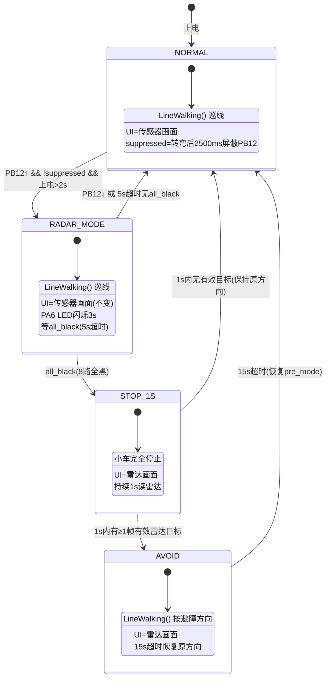
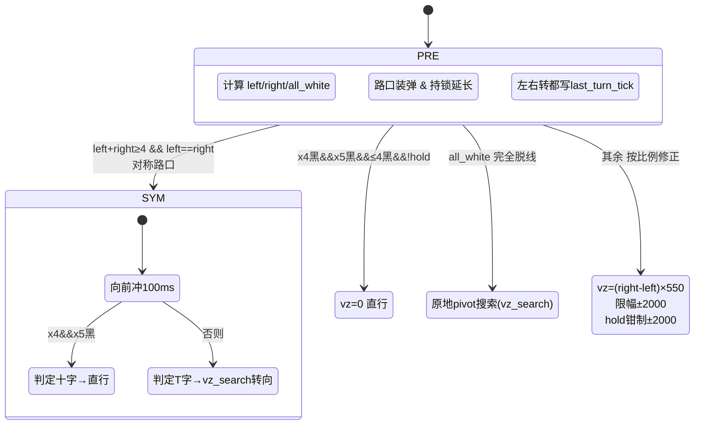
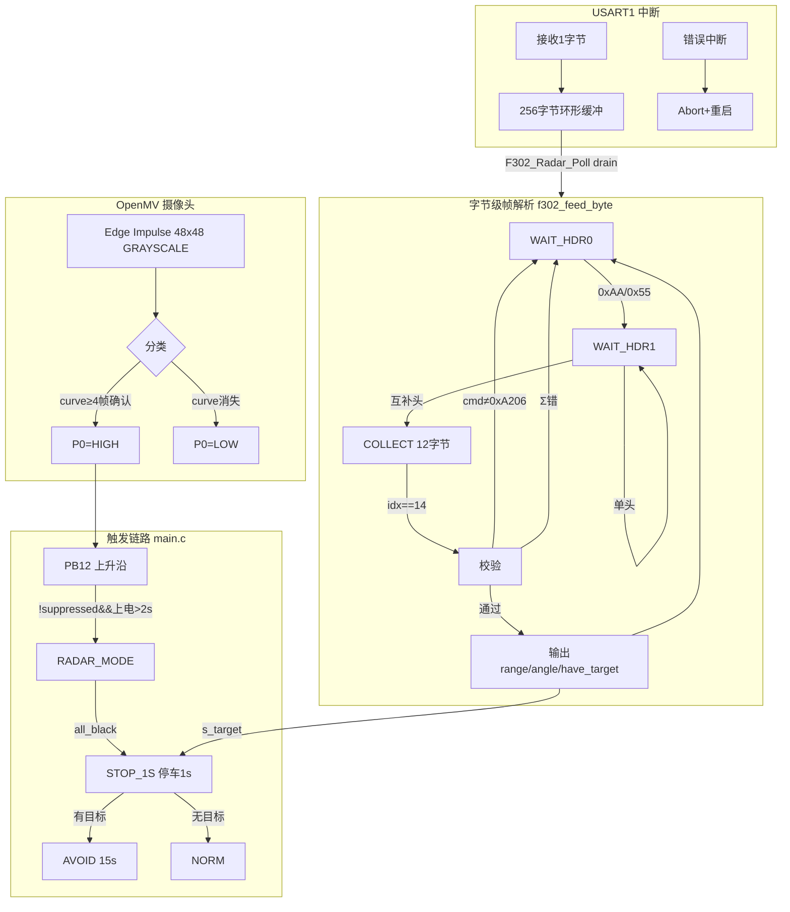

# Follow_lineV2 — 摄像头触发雷达避障巡线小车

STM32F103C8T6 + OpenMV + F302 毫米波雷达 + 八路灰度传感器

## 硬件连接

| 外设 | 接口 | 引脚 | 说明 |
|------|------|------|------|
| 八路灰度 | USART2 | PA2 TX → 模块 RX, PA3 RX ← 模块 TX | 115200 8N1 |
| F302 雷达 | USART1 | PA9 TX, PA10 RX | 115200 8N1, 0xA206 主动上报 |
| OLED | I2C1 | PB6 SCL, PB7 SDA | 128×64 SSD1306 |
| 电机驱动 | Soft I2C | MOTOR_SCL, MOTOR_SDA | |
| **OpenMV 摄像头** | GPIO | **P0 → PB12** | HIGH=T字路口, LOW=清除 |
| **LED 指示灯** | GPIO | **PA6** | RADAR_MODE 闪烁 3s |
| 按钮 (保留) | GPIO | PB13 | 输入上拉 (当前未使用) |

## 状态机总览



## LineWalking 行为分支



## 雷达数据通路



## 核心常量

### 巡线参数 (line_follow.h)

| 常量 | 值 | 说明 |
|------|----|------|
| `IRR_SPEED` | 150 | 巡线前进速度 |
| `VZ_PER_ERR` | 550 | 比例修正系数 |
| `VZ_SEARCH_LEFT` | -2500 | 脱线左转搜索 |
| `VZ_SEARCH_RIGHT` | +2500 | 脱线右转搜索 |
| `VZ_TURN_LEFT` | -2000 | Hold 钳制左转 |
| `VZ_TURN_RIGHT` | +2000 | Hold 钳制右转 |
| `TURN_HOLD` | 30 帧 | 转弯持锁帧数 |

### 状态机参数 (main.c)

| 常量 | 值 | 说明 |
|------|----|------|
| `SUPPRESS_MS` | 2500 | 转弯后屏蔽 PB12 窗口 |
| `RADAR_MODE_TIMEOUT_MS` | 5000 | RADAR_MODE 等 all_black 超时 |
| `STOP_DURATION_MS` | 1000 | 停车读雷达时间 |
| `AVOID_TIMEOUT_MS` | 15000 | 避障最大持续时间 |
| `STARTUP_IGNORE_MS` | 2000 | 上电忽略 PB12 窗口 |
| `RADAR_DIST_THRESH_CM` | 60 | 有效障碍距离上限 |
| `RADAR_ANGLE_LIMIT` | 6000 | 有效角度 ±60° |

## 文件结构

```
follow_lineV2/
├── Core/
│   ├── Inc/
│   │   ├── main.h
│   │   ├── stm32f1xx_hal_conf.h
│   │   └── stm32f1xx_it.h
│   └── Src/
│       ├── main.c              ← 顶层状态机
│       ├── stm32f1xx_hal_msp.c
│       └── stm32f1xx_it.c
├── Lib/
│   ├── Inc/
│   │   ├── line_follow.h       ← 巡线常量 & 接口
│   │   ├── ir_line8.h          ← 八路灰度驱动
│   │   ├── f302_radar.h        ← 雷达协议解析
│   │   ├── f302_radar_uart.h   ← 雷达 UART 驱动
│   │   └── motion_car.h        ← 运动控制
│   └── Src/
│       ├── line_follow.c       ← LineWalking() 行为分支
│       ├── ir_line8.c
│       ├── f302_radar.c        ← 字节级帧解析状态机
│       ├── f302_radar_uart.c   ← 环形缓冲 & ISR
│       └── motion_car.c
├── docs/
│   ├── 01_top_level.puml       ← 顶层 PlantUML
│   ├── 02_line_walking.puml    ← 巡线 PlantUML
│   └── 03_radar_pipeline.puml  ← 雷达 PlantUML
├── CMakeLists.txt
└── README.md                   ← 本文件
```

## OpenMV 端

```
ei-road-openmv-v2-impulse/
├── main.py              ← P0 GPIO 输出
├── trained.tflite       ← Edge Impulse 48×48 灰度模型
└── labels.txt           ← background / curve
```

模型：`background` / `curve` (curve = T 字路口)，连续 4 帧 score≥0.58 确认，P0 拉高。消失后 1800ms cooldown 再允许下次触发。

## 编译

```bash
cmake --preset Debug -S .
cmake --build build/Debug
```
